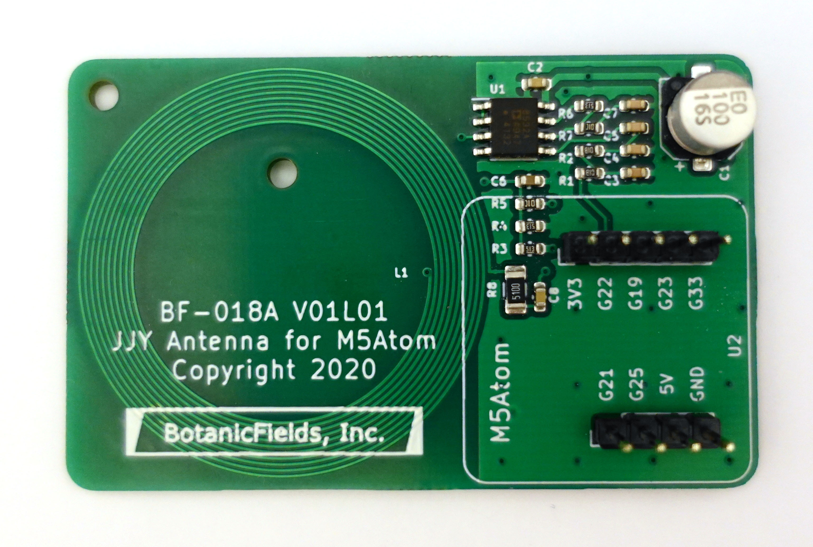
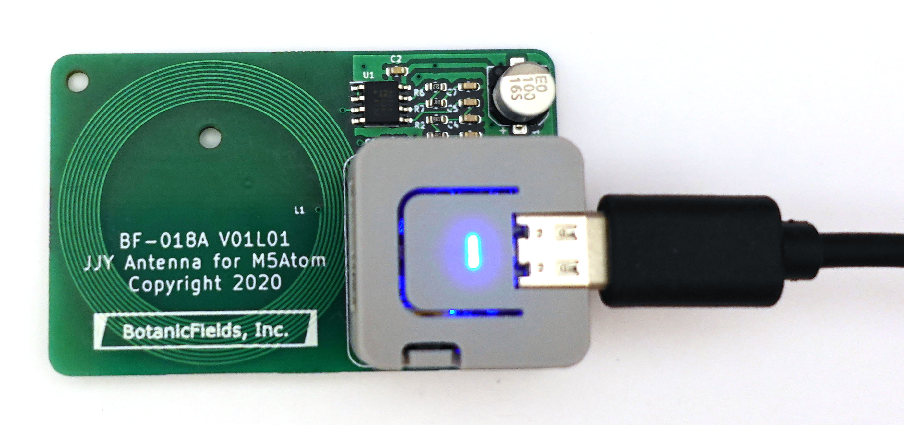
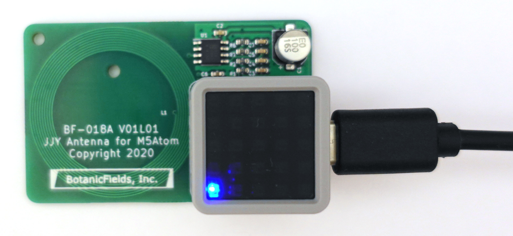
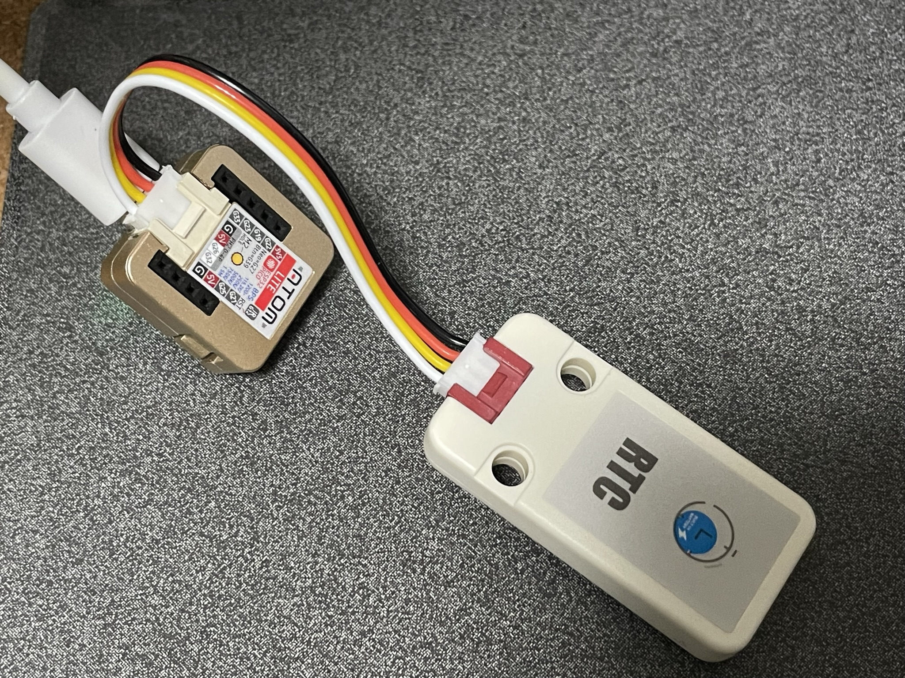
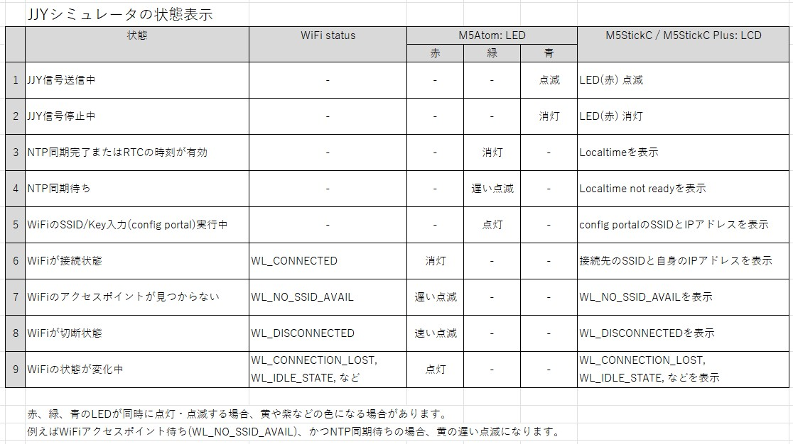

# JJY Simulator for M5Atom
## M5Atom Lite, M5Atom Matrixで動作する標準電波(JJY)シミュレータ

### 2023/4/27 修正
- BF-018ARev2.inoにおいてPWMの設定を改善しました。

### Rev.2
- フォルダ: BF-018ARev2
- 変更内容は、「8. Rev2 変更内容」を参照ください。

### Rev.1(無印)
- フォルダ: BF-018A
- Rev.2は、Rev.1を改良したものです。Rev.2をご使用ください。

## 1. 概要
　M5Atomで電波時計のためのJJY信号もどきを生成します。JJY信号が届かないところにある電波時計の時刻合わせができます。Wifi経由のNTPで時刻を取得し、GPIOからJJY信号を出力します。

参考: Qiita [標準電波 JJY もどきを M5StickC / M5Atom の Ticker で生成する](https://qiita.com/BotanicFields/items/a78c80f947388caf0d36)

## 2. ソフトウェア
　BF-018ARev2を確認したソフトウェアの参考情報です。

| tool | item | 2023/10/18 |
|:-:|:-:|:-:|
|Application| Arduino-IDE | 2.2.1 |
|Boards Manager| M5Stack by M5Stack official | 2.0.8 |
|Library Manager| M5Atom by M5Stack | 0.1.2  |
|Library Manager| FastLED by Daniel Garcia | 3.6.0 |
|Library Manager| WiFiManager by tzapu | 2.0.16-rc.2 |

## 3. ハードウェア
　JJY信号の送信にはアンテナが必要です。GPIO22とGND間に1kΩ程度の抵抗を途中に挟んで1m程度の電線を接続して実験できます。電線を電波時計の至近距離に這わせると電波時計が電線からの磁界を受信してくれます。

- 電線と1kΩの抵抗による動作例(M5StickC)  
Youtube [JJY Simulator by M5StickC for a radio controlled clock](https://youtu.be/S_t3g5wqyh8)

### 3.1 プリント基板
　M5Atomを搭載可能なプリント基板を製作しました。

- [回路図](./bf-018a_scm.pdf)

- プリント基板  
[PCB_front]  


- M5Atom Liteを搭載  
[PCB_with_M5AtomLite]  


- M5Atom Matrixを搭載  
[PCB_with_M5AtomMatrix]  


## 4. 動作

- 電源投入またはリセット後、まずWifi接続の動作に入ります
- Wifi接続が完了後、NTPで日時を取得し、標準信号の送出を開始します
- JJY信号オンを内蔵LEDでモニターできます。M5Atom Matrixでは、0番のLEDのみを使用しています  
Rev1の動作(Rev2は「8. Rev.2変更内容」を参照):  
  >青: JJY信号の送出中を示します  
赤: NTPによる時刻取得に失敗すると点灯します  
黄: Wifi接続が切れると点灯します（赤＋緑）

動作例  
- YouTube [BF-018A: JJY Antenna for M5Atom](https://www.youtube.com/watch?v=4Soobp9k9r0)

## 5. Wifi 接続
　tzapu/WiFiManagerを使用しています。使い方は、tzapu/WiFiManagerの説明を参照ください。

参考: GitHub [tzapu/WiFiManager](https://github.com/tzapu/WiFiManager)

### 大まかな流れ:
> (1)	M5Atomが、まずは前回接続したアクセスポイントに接続を試みる  
(2) 接続できない場合、M5Atom自身がアクセスポイントとなりスマートホン等からの接続を待つ
>> (2-1) スマートホン等で、アクセスポイントとなったM5Atomに接続する  
※ SSID: Chip IDに基づく名前、password/key: なし  
(2-2) ブラウザでIPアドレス192.168.4.1を開く  
(2-3) M5Atomが接続すべきSSID/keyを入力する

>(3)	M5Atomが指定されたSSID/keyでWi-Fiに接続する
## 5. LCD
　M5Atom版では外付けLCDを使用していません。

## 6. LED
　ボタンBでLEDによるモニターをオン・オフできます。

## 7. シリアルモニタ
　動作の状況を監視できます。

## 8. Rev.2変更内容

### (1) WiFi接続についてのリカバリ処理を改善
　WiFiのステータスに応じたリカバリ処理を追加しました。リカバリ処理には5分、10分、あるいはWiFiアクセスポイントが回復するまでなど、長時間を要する場合があります。放置して、いつの間にか正常動作をしていることを目指しています。リカバリ処理の内容は試行錯誤に基づくもので、必ずしもベストではありません。アドバイスなどありましたら是非お知らせください。

参考: Qiita [ESP32のWiFiおよびtzapu/WiFiManagerにおいて回復処理を試行錯誤した](https://qiita.com/BotanicFields/items/8a73101a8bfe51e57f67)

### (2)  RTCの利用を追加
　電源投入時やリセット時においてWiFiが一時的に接続できないときでも、RTCの時刻に基づいてJJY信号を発信します。このための準備として、NTPの時刻同期のタイミングでRTCの時刻をアップデートします。RTCは、直近のアップデートに基づいた現在時刻を保持しています。M5AtomのGROVEポートにRTCユニットを接続して利用できます。RTCユニットを20cmのGROVEケーブルで接続した場合は動作が不安定になり、10cmのケーブルで安定した経験があります。

利用可能なRTCユニットの例
- [M5Stack用HYM8563搭載 リアルタイムクロック（RTC）ユニット](https://www.switch-science.com/catalog/7482/)
- [M5 用リアルタイムクロック (RTC) 基板](https://www.switch-science.com/catalog/7170/)

参考: Qiita [ESP32 において NTP の時刻同期を捕まえて RTC を更新する](https://qiita.com/BotanicFields/items/f1e28af5a63e4ccf7023)

[RTCモジュール]  


### (3) SSID/Keyを消去する操作を追加
　接続先のWiFiアクセスポイントを変更する場合、SSID/Keyの設定を変更します。古いアクセスポイントが撤去済の場合、WiFiManagerのconfigration portalが自動的に起動します。古いアクセスポイントが稼働中の場合、まずEEPROMに保存されたSSID/Keyの消去することで新規設定ができます。EEPROMのSSID/Keyを消去するには、ボタンを押しながらリセットボタンを押しLEDが緑色に点灯するまでボタンを押し続けます。"configuration portal"が起動しています。

### (4) ~~60~~40kHzを使用
　JJY信号は、福島県の送信所から40kHz、佐賀県の送信所から60kHzで送信されています。PWM周波数は40kHzとしています。ESP32では60KHzぴったりの信号を生成できませんが、かなり近い周波数で生成できます。東日本の場合、疑似JJY信号を60kHzとすることで、福島からの信号に同期したのか、疑似信号に同期したのかを区別することができます。疑似信号を~~40~~60kHzに設定するには、BF-018ARev2.inoのledc_frequencyを~~40000~~60000に修正ください。
``` BF-018ARev2.ino
// PWM for TCO signal
const uint8_t  ledc_pin(22);           // GPIO22 for TCO
const uint8_t  ledc_channel(0);
const uint32_t ledc_frequency(40000);  // 40kHz(east), 60kHz(west)
const uint8_t  ledc_resolution(8);     // 2^8 = 256
const uint32_t ledc_duty_on(128);      // 128/256 = 50%
const uint32_t ledc_duty_off(0);       // 0
```

　ledcのfrequencyの型がdoubleからuint32_tに変更されました。

参考: Qiita [ESP32においてLEDC(LED PWM Controller)に設定する分解能をExcelシートで検討する](https://qiita.com/BotanicFields/items/e74c449c0bef0820fcd1)

### (5) LCD表示

- WiFiの接続状態を表示  
WL_CONNECTED以外の場合、赤LEDの点灯・点滅で表示
- config portalの起動時、緑LEDを点灯
- NTP同期待ち時、緑LEDを点滅

詳細: [JJYシミュレータの状態表示]

### (6) M5AtomのWi-Fi接続が不安定となる問題への対策

M5AtomにはWi-Fiの出力が低下し接続が不安定になる問題があります。USBシリアル変換用のCH552のファームウェア改善による対策が進んでいると期待されますが、未対策の既出荷品も多い状況です。対策としてGPIO0にLOWを出力する処理をsetup()の冒頭に追加しました。

#### 参考情報

- [twitter @wakwak_koba 午前8:36 2022年7月30日](https://twitter.com/wakwak_koba/status/1553162622479974400)
- [M5Atom CH552 FW更新](https://togetter.com/li/1807623)
- [Bugs and measures for M5Stack ATOM](https://macsbug.wordpress.com/2021/10/10/bugs-and-measures-for-m5stack-atom/)


以上